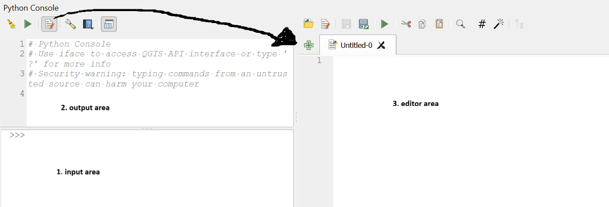

# Archeologie monitor scripts

In this repository a script has been created that calculate the area of various land-use types (based on top10 vector) for Dutch archaeological listed protected sites.

In order to get the script running there are two approaches:

# 1. Run the script through a jupyter notebook 

The notebook can be accessed here [jupyter_notebook](https://github.com/Morrizzzzz/archeologie_monitor_scripts/blob/main/union_monitor.ipynb)
In order to run the scripts it is recommended to follow the installation instructions of the [introduction to geospatial python](https://esciencecenter-digital-skills.github.io/geospatial-python/#software-setup) course.

The script uses the following libraries:
- geopandas
- requests
- pathlib
- fiona
- pandas

In case one of the packages is not installed, you can do that in a jupyter notebook by:

```python
!pip install geopandas
```

# 2. Run the script directly in QGIS
In order to run the script directly in QGIS. Open python console:



If necessary install using the **1. input area** the required packages by typing :

```python
!pip install geopandas
```

Next, open the **3. editor** and load the [script](union_arch_rijksmonumenten.py), modify the variables and run it.
